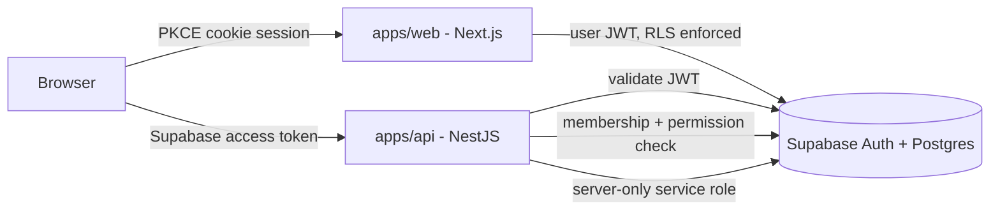

# Architecture

Qingyu Platform v2 is a pnpm/Turborepo monorepo with an intentionally narrow
foundation scope. Product applications are reserved but contain no product
features or sample tenant data.

## Application boundaries

- `apps/web`: public entry, Magic Link login, auth callback, protected dashboard,
  organization selection, and server-side membership verification.
- `apps/api`: health/readiness endpoints, Swagger, request IDs, structured logs,
  normalized errors, Supabase JWT verification, and the invitation endpoint.
- `apps/flow`, `apps/order`, `apps/knowledge`, `apps/liff`: buildable boundaries
  only. Feature development is deferred.
- `apps/legacy`: the unchanged production Vite application and its Vercel
  functions, historical SQL, assets, auxiliary site, and Python RAG demo.
- `services/rag`: reserved strict-TypeScript v2 boundary. It does not import or
  expose the legacy Python demo.

## Shared packages

- `auth`: framework-independent Magic Link, logout, bearer-token, and membership
  primitives.
- `config`: Zod-validated public and server environment contracts.
- `database`: tenant and role types. SQL remains authoritative in migrations.
- `validation`: request schemas shared by API clients and controllers.
- `ui`: accessible, framework-neutral React components.
- `notifications`: provider contract only; no provider or credentials included.
- `observability`: request IDs and structured log records.

## Trust boundaries

The browser never receives the Supabase service-role key. `apps/web` uses the
publishable key with the signed-in user's cookie session, so Postgres RLS remains
the final data boundary. `apps/api` accepts a bearer token, validates it with
Supabase Auth, checks membership and permission again, and only then performs a
server-side mutation.

Every tenant-owned table carries `organization_id`. Global identity/catalog
tables are limited to `profiles` and `permissions`; `organizations.id` is the
tenant identifier itself.
